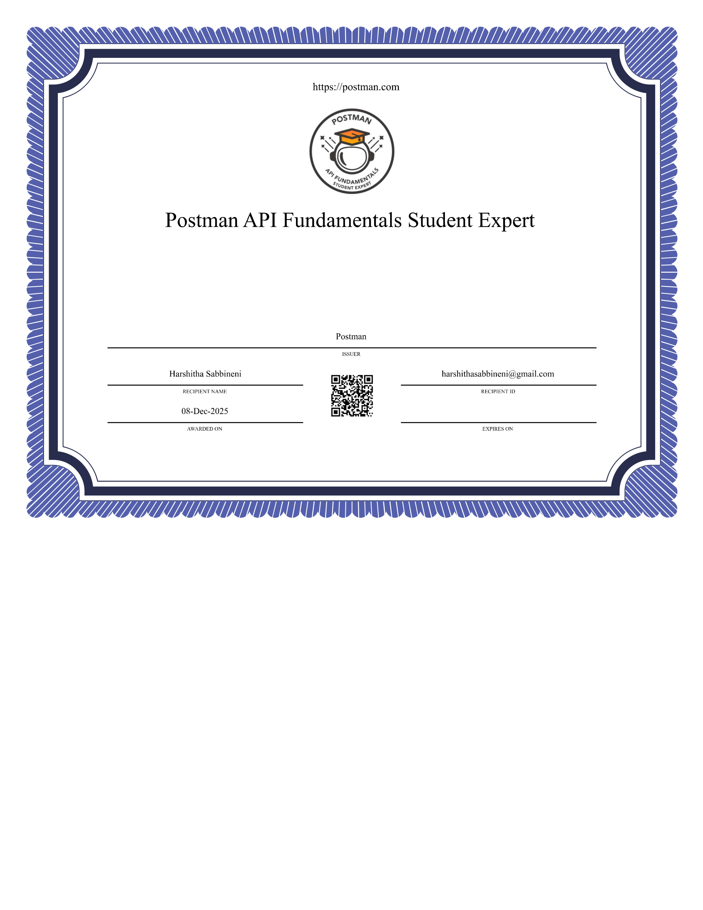

 

<h3 align="center">A passionate Frontend & Angular Developer from India</h3>

---

## 🚀 About Me
- 🌱 I’m currently learning **Angular 20, TypeScript, Cloud**
- 👨‍💻 All my projects are available here on GitHub
- 📫 How to reach me: **your-email@example.com**

---

## 🛠️ Skills

### **Frontend**

### **Tools**

---

  

------
 

 
https://raw.githubusercontent.com/harshithasabbineni/harshithasabbineni/main/harshithasabbineni.png

 

---
## 📊 GitHub Activity

----------------

## 🏆 Certifications

-----------------------------

## 🏅 Hackathon Achievements

  
  
  
   

--------------------------------

## 🔥 Contribution Graph

## 🐍 Snake Animation

---
## 🏆 GitHub Trophies

  

